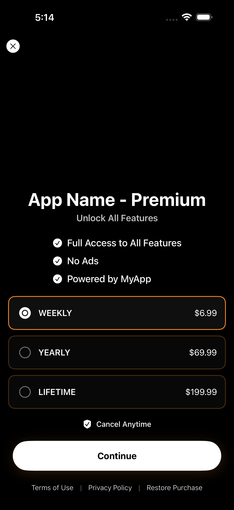

# PaywallKit_RevenueCat

A customizable SwiftUI Paywall SDK built on top of RevenueCat. This SDK handles displaying products, feature lists, and subscription logic.



---

## Features

- **🔌 RevenueCat Integrated**: Connects to RevenueCat dashboard.

- **🎨 Dynamic Styling**: Custom accent colors, titles, and subtitles.

- **📋 Feature Lists**: Per-product feature lists to highlight the value of different tiers.

- **🕒 Custom UX**: Built-in "Close Button Delay" to prevent accidental dismissals and increase conversion.

- **⚖️ Legal Compliance**: Integrated links for Terms of Service and Privacy Policy.
  
- **🛠 State Management**: Robust callbacks for purchase success, failure, and dismissal.

- *Analytics support, custom background and Remote Config will be added in future.*

---

## Installation

Swift Package Manager (SPM)
In Xcode, go to File > Add Packages...

Enter the repository URL: [BKCustomComponentsKit](https://github.com/FallikTheCat/BKPaywallKit)

Select Up to Next Major Version and click Add Package.

---

## Example Usage

```swift
@StateObject var paywallManager = PaywallManager(apiKey: "REVENUECAT_API_KEY")
```

```swift
PaywallView(
    manager: paywallManager,
    configuration: PaywallConfiguration(
        title: "App Name - Premium",
        subtitle: "Unlock All Features",
        accentColor: Color.orange,
        products: [.weekly, .yearly, .lifetime],
        featureListFor: { product in
            switch product {
            case .weekly:
                return ["Full Access to All Features", "No Ads", "Powered by MyApp"]
            case .yearly:
                return ["Full Access to All Features", "Save 40%", "Everything in Weekly"]
            case .lifetime:
                return ["Lifetime Access", "No recurring payments", "All future updates included"]
            }
        },
        productIdentifiers: [
            .weekly: "com.myapp.weekly",
            .yearly: "com.myapp.yearly",
            .lifetime: "com.myapp.lifetime"
        ],
        closeButtonDelay: 4,
        termsAndConditions: URL(string: "https://example.com/terms")!,
        privacyPolicy: URL(string: "https://example.com/terms")!
    ),
    onClose: {
        showPaywall = false
    },
    onPurchaseSuccess: {
        ///Activate Premium
    },
    onPurchaseFailure: { error in
        ///Analytics & Error Handling
    }
)
```

---

